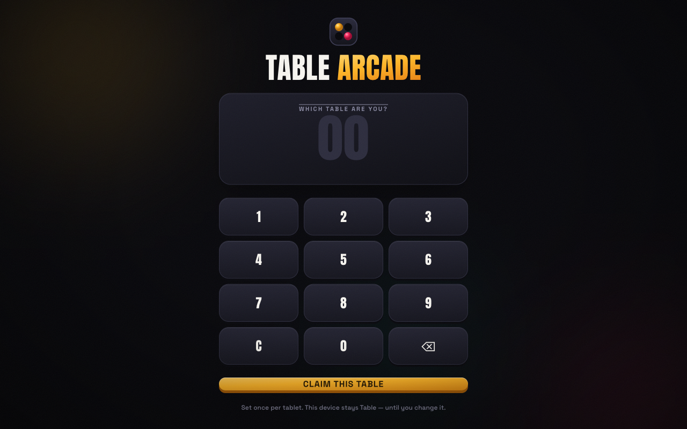

# Table Arcade

Tablet games for a bar, played table against table. You claim a table number, challenge
another table on the floor plan, and pick something off the menu to play for. The loser's
tab covers it, and a ticket lands on the staff screen so a server can run the item over.



## The games

| Game | Format | How it ends |
| --- | --- | --- |
| **Connect 4** | Turn-based | Four in a row, or a filled board for a draw |
| **Beer Pong** | Turn-based | Sink all ten cups; a hit keeps the ball |
| **Soju Run** | Simultaneous race | Fly the bottle through gates, furthest run wins |
| **Stacker** | Simultaneous race | Climb 15 rows as the tower narrows and speeds up |

Every table plays a bot if there's no human opponent, so the floor always looks busy.

## How it fits together

The server owns the truth. Clients send intent (`{ column }`, `{ power, angle }`) and the
server decides what happened — a tablet can't declare itself the winner, because the wager
settles a real tab.

Games are plugged in through a small registry (`server/games/index.js`). A module implements:

```js
create({ players, first })   // initial state
view(game, me)               // what this player is allowed to see
action(game, me, payload)    // validate + apply a move
tick(game, ctx)              // drive the bot
```

Two modes exist: `turn` (Connect 4, Beer Pong) and `race` (Soju Run, Stacker), where both
tables play at once against a shared seeded course. The seed means both tablets render an
identical run without streaming any geometry between them.

State lives in memory. There's no database and no auth — this is a pitch demo, and stopping
the process wipes the room.

## Staff screen

`/staff` has two tabs:

- **Tickets** — every settled wager, who to charge, who to deliver to, and a "mark delivered" button
- **Floor plan** — a drag-and-drop editor for the room layout

The floor plan is the real restaurant's layout, so a table on screen is the table you're
sitting at. Edits save to `data/floorplan.json` and push live to every connected tablet.

## Running it

```sh
npm install
npm run dev
```

- Guest tablets — `http://localhost:5173`
- Staff — `http://localhost:5173/staff`

`npm run dev` prints a LAN address too, which is what the tablets actually point at.

```sh
npm test            # server-side game rules
npm run build       # production client bundle
npm start           # serve the built client from the node server
```

## Layout

```
server/
  index.js        http + socket.io entry
  handlers.js     lobby, challenges, games, tickets
  state.js        in-memory tables/games/tickets, menu, bot tables
  floorplan.js    load, validate and persist the room layout
  games/          one module per game, plus rng + shared race logic
src/
  screens/        lobby, game host, per-game screens, result, staff
  components/     board, chrome, icons
  styles/         Tailwind v4 theme and per-game CSS
```

Built with React, Vite, Tailwind, Express and socket.io. Designed for a landscape tablet.
