# Table Arcade — feature reference

Every table in the bar has a tablet. A table claims its number, sees the rest of the room on
a floor plan, and challenges another table to a game with a menu item on the line. The loser's
tab covers it and a ticket lands on the staff screen so a server can run the item over.

This document covers what is actually built, from both sides of the room. Screenshots live in
[`screenshots/`](screenshots).

---

# Part 1 — The table side

## Claiming a tablet

A tablet with no table assigned shows a dead `00` and tells the guest to ask a server. Table
numbers belong to staff, so the way into the assignment keypad is a deliberate **1.2 second
press-and-hold** on the number, not a tap a guest can hit by accident.

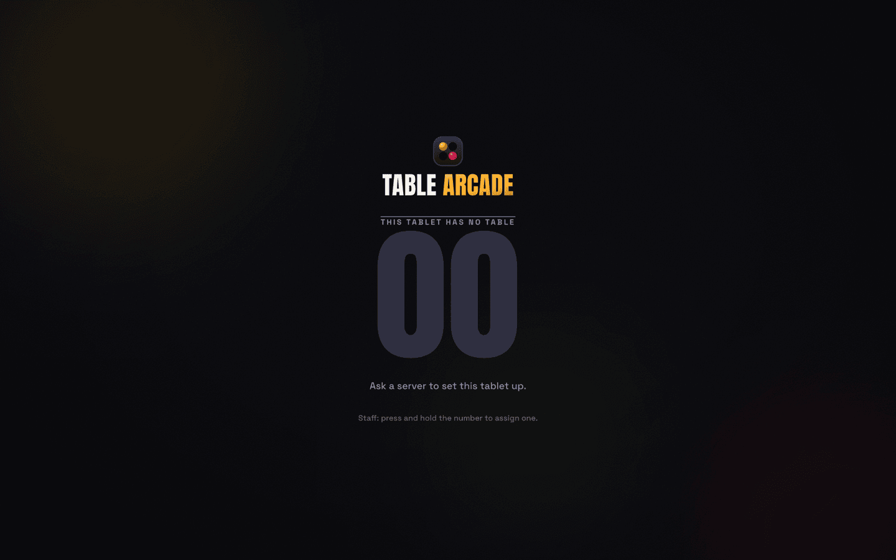

Staff hold the number, key in 1–99, and assign. The keypad refuses a number that is already in
play. The tablet remembers its number in `localStorage`, so a reload or a dropped connection
puts it back on the same table.

Assigning is not the same as being open for business. The tablet then shows a single
full-screen **Tap to play** target, and until someone taps it the rest of the floor cannot see
or reach the table. That is what stops an empty table from being challenged.

## Home

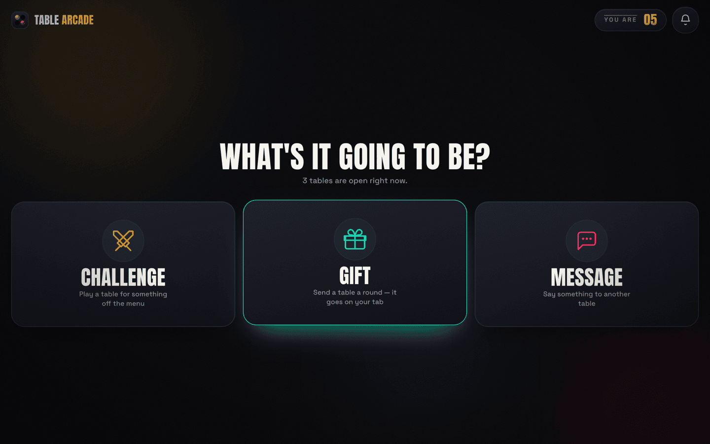

Three things to do — **Challenge**, **Gift**, **Message** — plus a live count of how many
tables are open right now. The header carries the table number (hold it to reassign) and an
inbox bell with an unread badge.

**Inbox.** Challenges, gifts and messages collect in a dropdown with sender, preview and a
relative timestamp. Opening the inbox marks everything read; tapping an entry jumps to it.
Capped at 40 entries.

**Toasts.** Short banners for the things that happen while you are looking elsewhere: a
challenge declined or timed out, a gift arriving, a message landing, a table dropping off.

**Offline banner.** If the socket drops, a `Reconnecting` bar appears at the top and the
tablet keeps retrying on its own.

## The floor plan

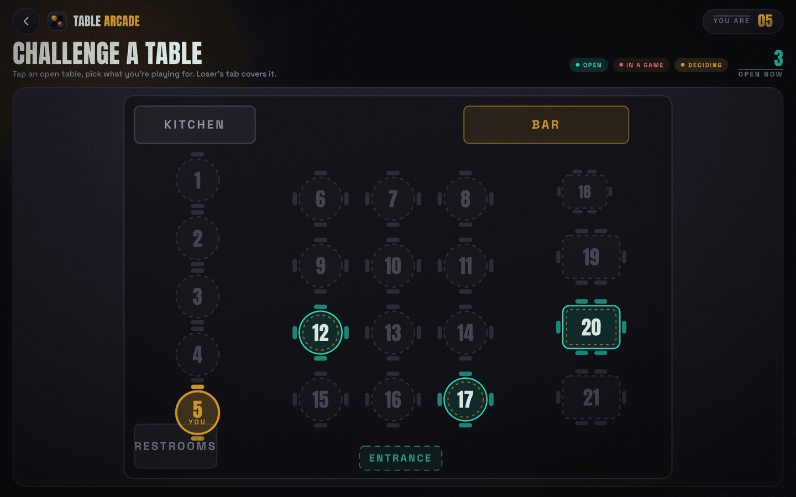

The floor plan is the real room — the bar, the kitchen, the entrance, the restrooms, and every
table drawn with its own shape and its own chairs. A table on screen is the table you are
sitting at, which is the whole point: you pick an opponent by looking across the room and
finding them on the plan.

Your own table wears a gold halo. Every other table carries a status:

| Status | Meaning |
| --- | --- |
| **Open** | Signed in and idle — can be challenged |
| **In a game** | Currently playing |
| **Deciding** | Has a challenge pending either way |
| Offline | Tablet disconnected; can still be messaged for when they return |

The same plan backs all three modes, filtered to suit: **Challenge** shows only tables you can
actually play, **Gift** shows everyone on the floor, and **Message** shows everyone including
tables you have blocked, so you can still open the thread and unblock them. In message mode
tables carry an unread-count badge.

## Sending a challenge

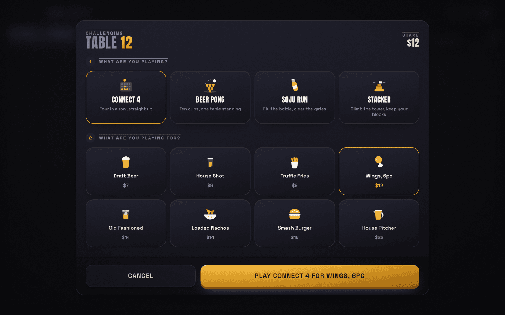

Tapping a table opens a two-step sheet: pick one of the four games, then pick what you are
playing for. The stake total updates live and the button spells the whole thing out —
*Play Connect 4 for Wings, 6pc*.

The menu is eight items, drinks and food, $7 to $22:

| | | | |
| --- | --- | --- | --- |
| Draft Beer $7 | House Shot $9 | Truffle Fries $9 | Wings, 6pc $12 |
| Old Fashioned $14 | Loaded Nachos $14 | Smash Burger $16 | House Pitcher $22 |

Once sent, both tables watch the same **30 second** countdown ring.

| Sender waits | Receiver decides |
| --- | --- |
| 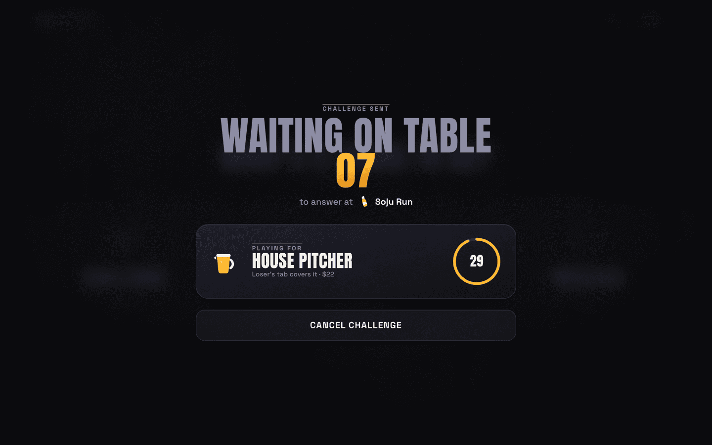 | 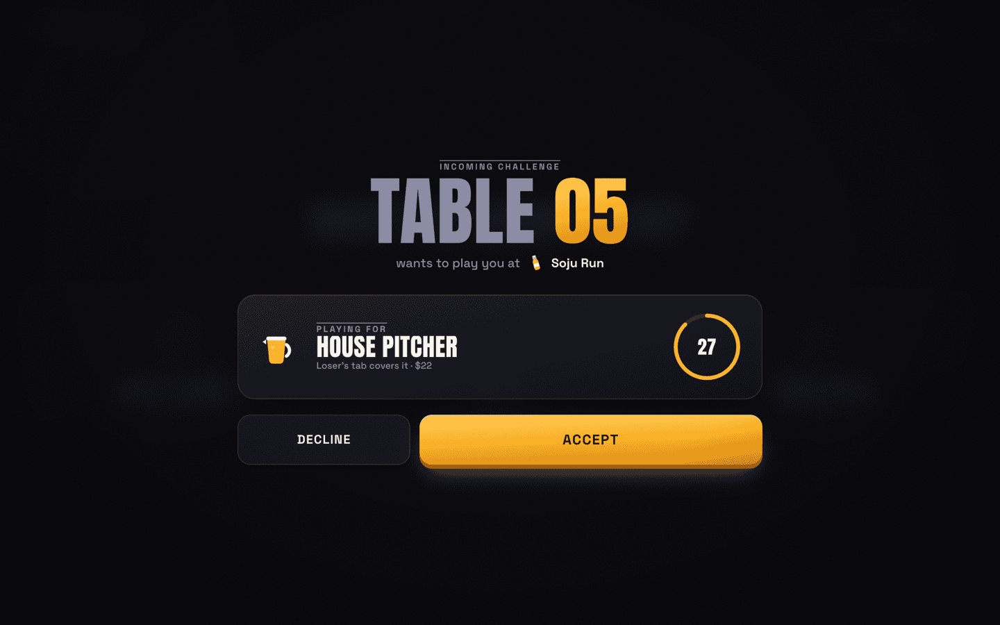 |

The sender can cancel; the receiver can accept or decline; if nobody answers it expires and
both sides get told why. If two tables challenge each other at the same moment, the lower table
number wins the race and the other one is told to answer the invite it already has.

## The games

Four games, two shapes. **Turn** games alternate; **race** games run both tables at once
against an identical, seeded course.

| Game | Mode | Shape | How it ends |
| --- | --- | --- | --- |
| **Connect 4** | turn | 7 columns × 6 rows | Four in a row, or a full board for a draw |
| **Beer Pong** | turn | 10 cups racked 4-3-2-1 | Sink all ten; a hit keeps the ball |
| **Soju Run** | race | 60 gates | Furthest run wins |
| **Stacker** | race | 15 rows × 7 columns | Most rows climbed wins |

### Connect 4


The challenged table moves first. Tap a column to drop; the winning line lights up. The rail on
the left is the same on every game: the stake you are playing for, both tables with the active
one marked, and a status panel that goes gold on your turn.

### Beer Pong

Two-phase aiming rather than a drag: a needle sweeps for **angle**, you tap to lock it, then a
bar fills for **power** and you tap again. The server turns those two numbers into a landing
point with a little scatter, and anything within the hit radius sinks. Sinking a cup keeps the
ball, so runs happen. Bots are given a fixed aim wobble drawn once per game, tuned to land
around a 40–65% hit rate — tight enough to be a threat, loose enough that the ball comes back.

### Soju Run

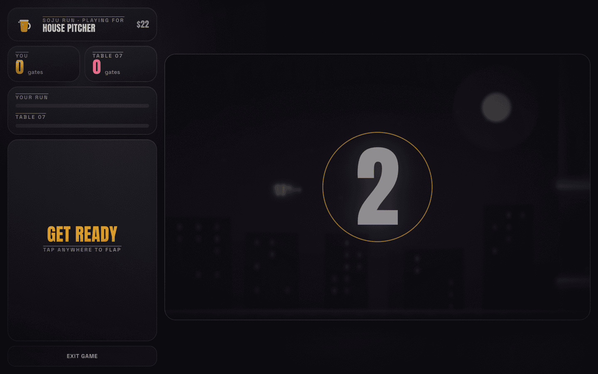

Tap to flap a soju bottle through 60 gates. The gap narrows and drifts more the deeper you get,
so a long run is genuinely hard rather than just long. Both tables count in together from 3 and
fly the same course; the rail shows both scores and the opponent's progress as they go.

### Stacker

Time the sliding block and lock it. Only the overlap with the row below survives — the rest is
chopped off and thrown clear. The tower narrows at the two classic tiers (3 blocks, then 2,
then 1) and speeds up as it climbs, but the ramp is deliberately held above ~160ms per cell so
the top rows stay a read rather than a coin flip. Reaching row 15 is a top-out.

### Walking away

Every game has an exit, and the confirmation says what it costs before you take it: the match
goes to your opponent and the item you played for lands on your tab. That is the wager working
as intended rather than a penalty, so the result screen names it as walking away.

### If a tablet drops mid-game

The game freezes exactly as it stands and the other table gets a *hold tight* overlay with a
**60 second** countdown. If the missing table comes back inside that window, play resumes
untouched. If it does not, the remaining table can claim the win.

## Results and settlement

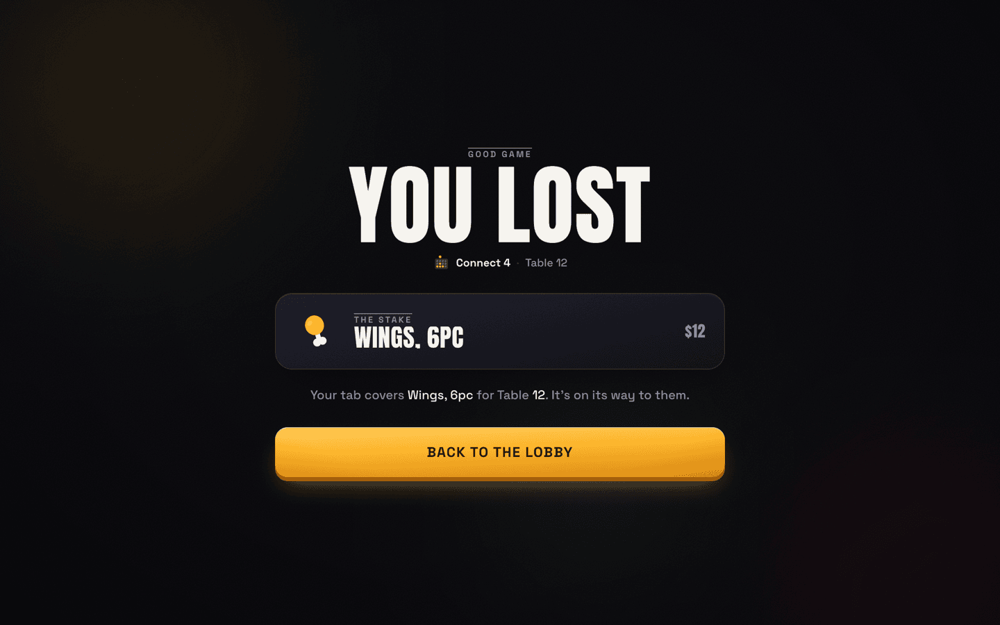

Win, lose or draw, the result screen names the game, the opponent, the item and who is paying
— *your tab covers it* or *theirs does*. A draw moves nothing. A win throws confetti. Every
settled wager creates a ticket on the staff screen; a draw does not.

## Gifts

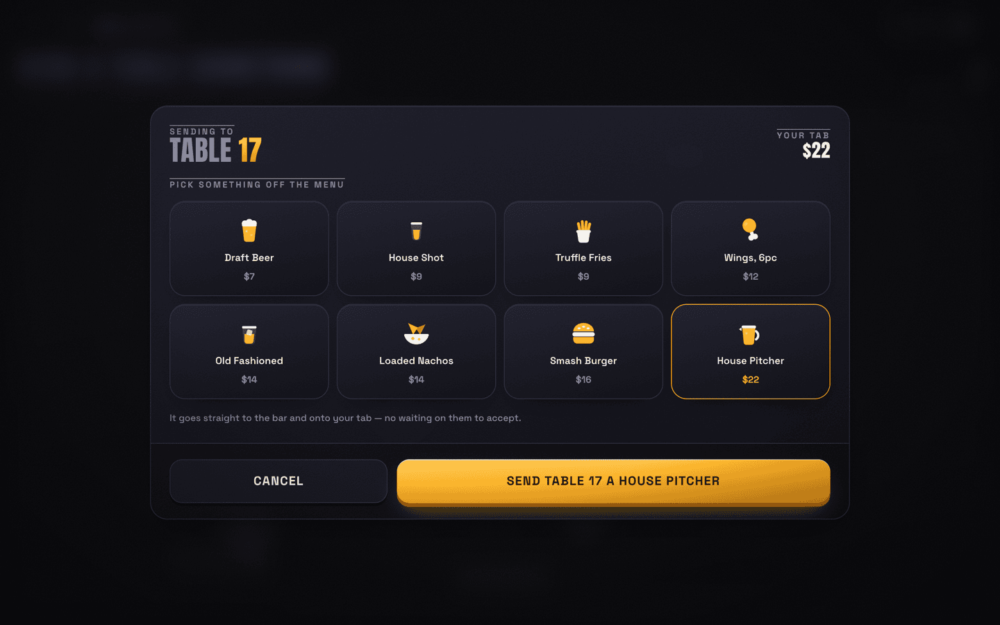

A gift is the same menu with none of the ceremony: pick an item, pick a table, and it goes
straight to the bar and onto **your** tab. There is nothing for the other table to accept —
they just get told a round is on its way, and a ticket appears for staff.

## Messaging

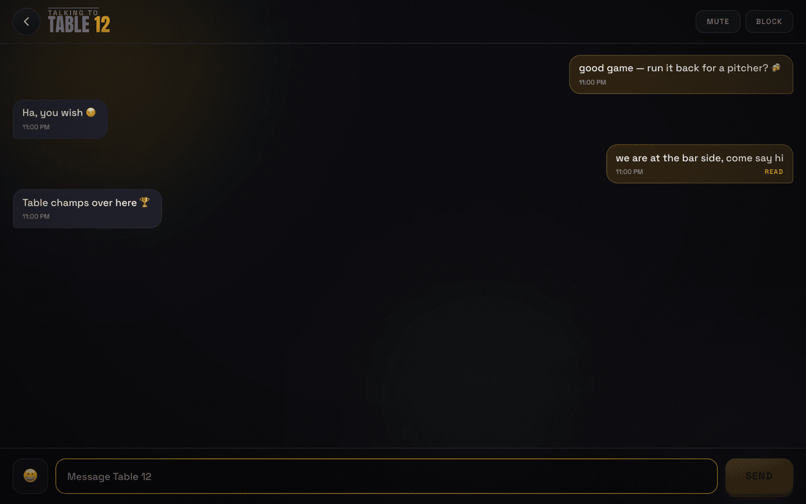

One thread per pair of tables, whichever side opens it first. Free text up to 280 characters,
with an emoji picker organised into six tabs. Threads keep their last 200 messages.

Senders can see whether a message landed:

- **Sent** — accepted by the server
- **Delivered** — the other tablet is online
- **Read** — the other table has the thread open

A message that arrives while you are elsewhere raises a toast and an unread badge; if you
already have the thread open it is marked read and stays quiet.

**Mute** silences the alerts from a table but keeps the conversation. **Block** cuts them off
entirely — no messages, no gifts, no challenges — clears what they already sent, and declines
any challenge of theirs still standing. Blocked tables stay visible in message mode so you can
find the thread and undo it.

## Bots

Tables **12**, **17** and **20** are always occupied, spread across the plan's three zones so
the floor reads as busy on a demo night. They accept challenges after a beat, play all four
games, reply to messages in character, and say thanks for a round.

---

# Part 2 — The staff side

The staff screen lives at `/staff` and has two tabs.

## Tickets

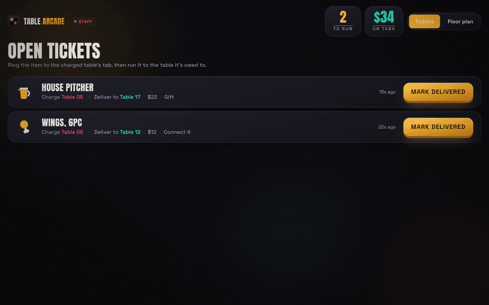

Every settled wager and every gift becomes a ticket. Each one says the item, **which table to
charge**, **which table to deliver to**, the price, and where it came from — the game that was
played, or *Gift*. Open tickets sit on top, newest first; delivered ones fade into a history
below. The header keeps a running count of how many are still to run and how much is sitting on
tabs.

Marking a ticket delivered is the only action, and it is one tap.

## Floor plan editor

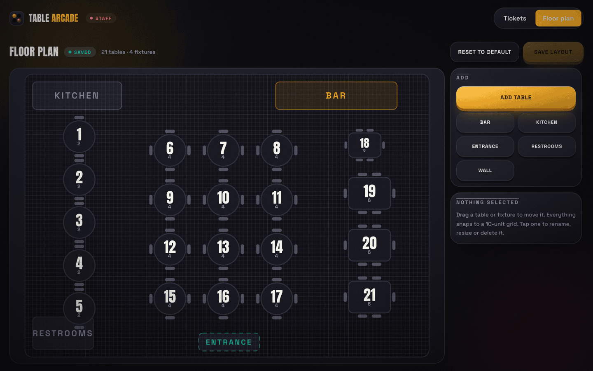

The floor plan is not decoration, so staff can edit it to match the actual room. Tables and
fixtures are dragged into place on a snapping grid and resized with corner handles. Tables can
be renumbered, switched between round and rectangular, and given a seat count that changes the
chairs drawn around them. Fixtures cover the bar, kitchen, entrance, restrooms and plain walls.

Edits are local until saved, with an unsaved-changes marker and a save that refuses to run
while two tables share a number. Saving writes `data/floorplan.json` and pushes the new plan
live to every connected tablet. There is a reset to the default 21-table plan.

## Table inspector

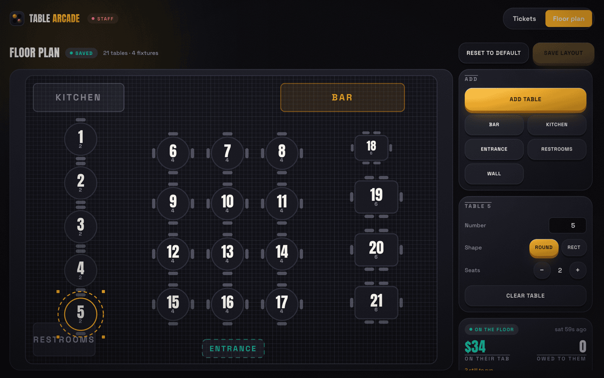

Selecting a table opens a panel with its number, shape and seats, what it currently owes and is
owed, and its activity: sat down, challenged, played, won, lost, sent a round, went offline.
*What* tables said to each other is deliberately not shown — staff can see that two tables
talked, not the conversation.

**Clear table** is how a party is turned over, and because it is irreversible it opens a dialog
listing the tab, the tickets and the activity it is about to destroy first. Clearing wipes the
threads, notifications, history, mutes and blocks, and puts the tablet back to its unassigned
screen for the next party.

---

# Part 3 — How it works

## The server owns the truth

Clients send intent — `{ column }`, `{ power, angle }` — and the server decides what happened.
A tablet cannot declare itself the winner, because the wager settles a real tab. State is
broadcast back as a whole-world `state:sync` over Socket.IO, filtered per table so a tablet only
receives what it is allowed to see.

## Games are plugged in

Games are registered in `server/games/index.js`. A module implements four functions:

```js
create({ players, first })   // initial state
view(game, me)               // what this player is allowed to see
action(game, me, payload)    // validate + apply a move
tick(game, ctx)              // drive the bot
```

Race games are built on a shared helper (`server/games/race.js`) that handles the count-in, the
two-minute ceiling, bot pacing and settling once both tables are done. A race game only supplies
a course builder and a bot profile — which is why Soju Run and Stacker are about thirty lines
each.

## Seeded courses

Both tablets in a race build their course from the same seed, so they render an identical run
without streaming any geometry between them. The seed is the only thing that crosses the wire.

## State

Everything except the floor plan lives in memory: tables, challenges, games, tickets and
conversations. Stopping the process wipes the room. The floor plan is the exception and
persists to `data/floorplan.json`, validated and clamped on load, falling back to the default
plan if the file is missing or malformed.

## Tunables

| Setting | Value | Where |
| --- | --- | --- |
| Challenge expiry | 30s | `server/state.js` |
| Reconnect grace | 60s | `server/state.js` |
| Bot tables | 12, 17, 20 | `server/state.js` |
| Menu and prices | 8 items | `server/state.js` |
| Message length / thread / inbox / history | 280 / 200 / 40 / 40 | `server/state.js` |
| Race count-in and ceiling | 3.2s / 120s | `server/games/race.js` |
| Beer pong bot wobble | 0.11–0.2 | `server/games/beerpong.js` |
| Default floor plan | 21 tables, 4 fixtures | `server/floorplan.js` |

---

# Part 4 — Deliberately not built

This is a demo for pitching bar owners, not a pilot. The following are missing on purpose, not
by omission:

- **No database.** A bar night is ephemeral; a restart wipes the room.
- **No accounts or auth.** Tables are identified by number. Anyone who reaches `/staff` can run
  the floor.
- **No POS or payments.** "The loser's tab" is a ticket a human acts on, not an integration.
- **No sound.** Every game is silent.
- **No stats or leaderboards** for guests, and no analytics for staff beyond the open-ticket
  total.

Open questions a bar owner will reasonably ask, and which v1 does not answer: whether every
table even has a tab, what POS integration would take, and how the wager should be framed
legally.
